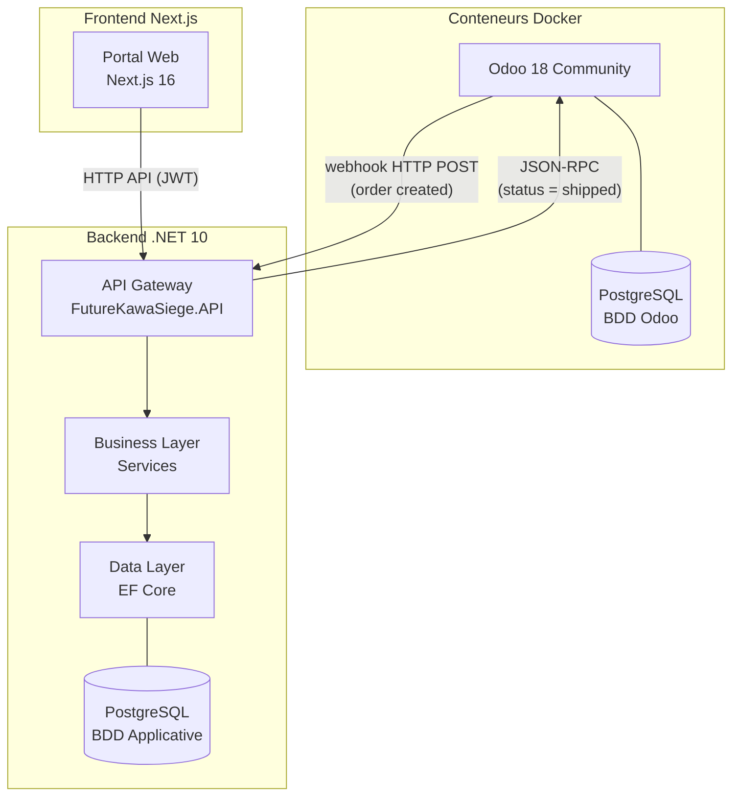
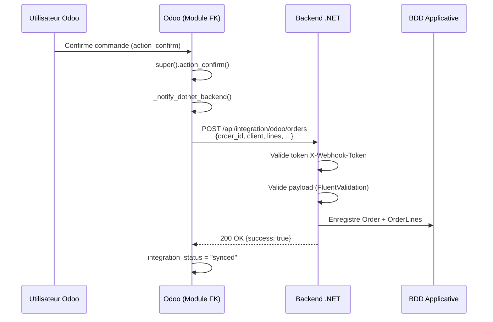
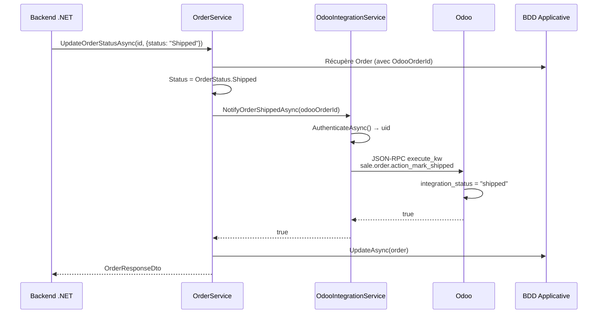

# Architecture — Intégration ERP Odoo

## Vue d'ensemble



## Composants

### 1. Odoo 18 Community (Conteneur Docker)

- **Image** : `odoo:18.0`
- **Port** : 8069
- **BDD** : PostgreSQL 16 dédié (conteneur séparé)
- **Module personnalisé** : `future_kawa_erp` (Python, framework ORM Odoo)

### 2. Backend .NET 10 (API Gateway)

- **Rôle** : Point d'entrée unique pour le frontend, gateway vers Odoo
- **Endpoints** :
  - `POST /api/integration/odoo/orders` — reçoit le webhook Odoo (token partagé)
  - `GET /api/orders` — liste des commandes (JWT)
  - `GET /api/orders/{id}` — détail d'une commande (JWT)
  - `PATCH /api/orders/{id}/status` — mise à jour du statut (JWT, notifie Odoo si shipped)
- **BDD** : PostgreSQL dédié (entités User, RefreshToken, Order, OrderLine)

### 3. Frontend Next.js 16

- **Rôle** : Portal web (non inclus dans ce périmètre)
- Communique uniquement avec le backend .NET

## Flux de données

### Flux 1 : Création de commande (Odoo → .NET)



### Flux 2 : Expédition de lot (.NET → Odoo)



## Sécurité

| Aspect              | Mécanisme                                           |
| ------------------- | --------------------------------------------------- |
| Webhook Odoo → .NET | Token partagé dans header `X-Webhook-Token`         |
| API .NET → Frontend | JWT Bearer (HMAC-SHA256)                            |
| .NET → Odoo         | Credentials Odoo (db, login, password) via JSON-RPC |
| Rate limiting       | Webhook : 30 req/min, Login : 5 req/min             |

## Configuration

### Paramètres système Odoo

| Paramètre                   | Valeur (dev)                                                     |
| --------------------------- | ---------------------------------------------------------------- |
| `future_kawa.webhook_url`   | `https://host.docker.internal:55648/api/integration/odoo/orders` |
| `future_kawa.webhook_token` | `futurekawa-webhook-shared-token-change-me`                      |

### appsettings.Development.json (.NET)

```json
{
  "Odoo": {
    "Url": "http://localhost:8069",
    "Db": "futurekawa",
    "Username": "admin",
    "Password": "admin",
    "WebhookToken": "futurekawa-webhook-shared-token-change-me"
  }
}
```
