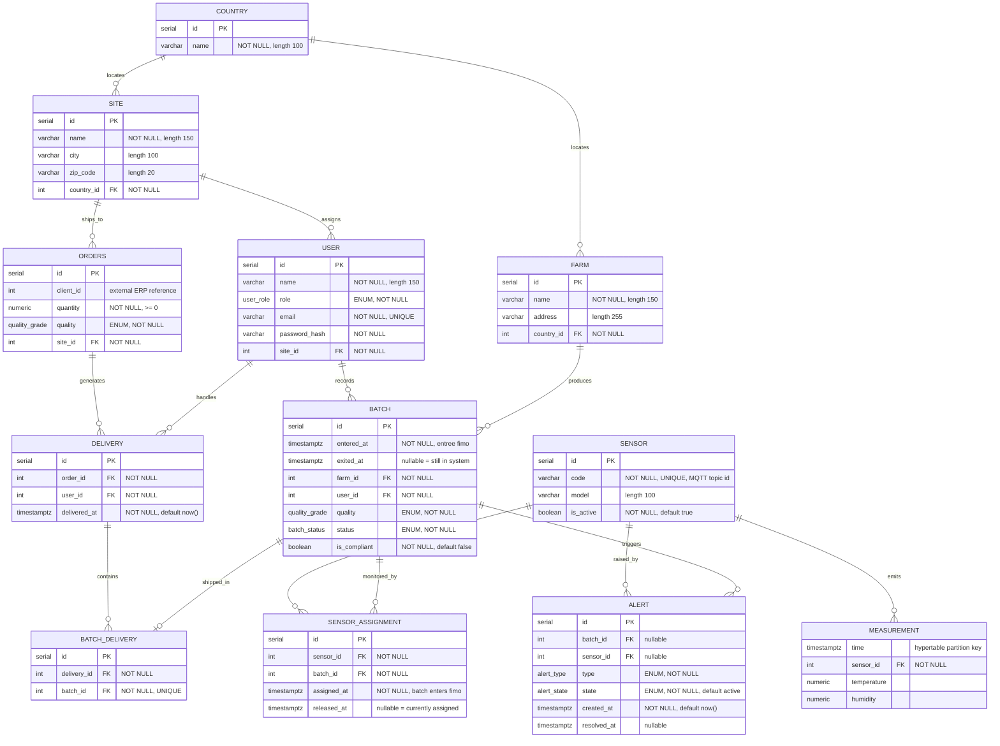

# Modèle Entité-Relation — FutureKawa

Cible : **PostgreSQL 16** (+ TimescaleDB pour les relevés issus du flux MQTT).

> Les relevés (`MEASUREMENT`) vivent dans une **hypertable Timescale**. Le lien
> mesure ↔ batch passe par `SENSOR_ASSIGNMENT` (fenêtre temporelle), pas par une FK
> directe : un capteur est réassigné à un nouveau batch une fois l'ancien sorti.

## Types ENUM

```sql
CREATE TYPE user_role     AS ENUM ('admin', 'operator', 'driver');
CREATE TYPE batch_status  AS ENUM ('in_stock', 'delivered');
CREATE TYPE quality_grade AS ENUM ('premium', 'mid_range', 'robusta');
-- quality_grade extensible via ALTER TYPE ... ADD VALUE
CREATE TYPE alert_type    AS ENUM ('condition', 'expiration');
CREATE TYPE alert_state   AS ENUM ('active', 'resolved');
```

## Diagramme



## Traçabilité mesure ↔ batch

Un capteur mesure **un seul batch à la fois**, sur la fenêtre passée dans le fimo.
`SENSOR_ASSIGNMENT` matérialise cette fenêtre ; à la sortie du batch on renseigne
`released_at`, ce qui libère le capteur pour un nouveau batch.

Les mesures d'un batch se retrouvent par jointure sur le capteur **et** la fenêtre :

```sql
SELECT m.time, m.temperature, m.humidity
FROM measurement m
JOIN sensor_assignment sa ON sa.sensor_id = m.sensor_id
WHERE sa.batch_id = :batch_id
  AND m.time >= sa.assigned_at
  AND m.time <  COALESCE(sa.released_at, now());
```

Contraintes clés (à poser dans les migrations) :

- `MEASUREMENT` : hypertable, PK composite `(sensor_id, time)` — la colonne de
  partitionnement `time` doit faire partie de tout index unique.
- `SENSOR_ASSIGNMENT` : **pas de chevauchement par capteur** — contrainte
  d'exclusion `EXCLUDE USING gist (sensor_id WITH =, tstzrange(assigned_at, released_at) WITH &&)`
  (extension `btree_gist`). Garantit qu'un capteur n'est jamais sur deux batchs en même temps.
- `BATCH_DELIVERY.batch_id` : `UNIQUE` — un batch (acheté en entier) n'apparaît que sur une ligne.
