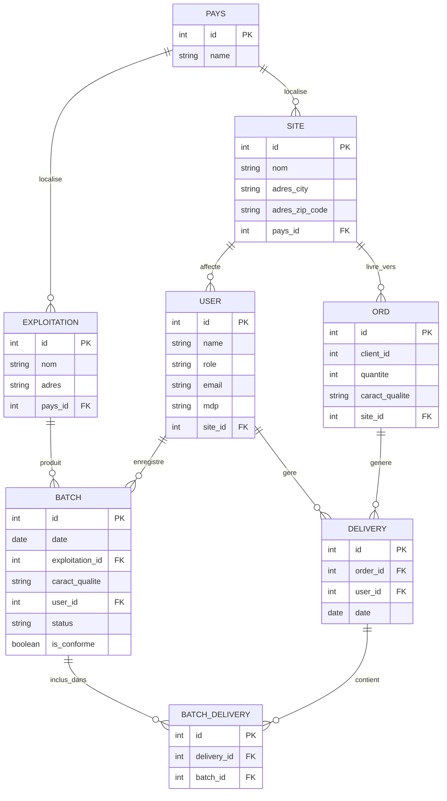

```mermaid
erDiagram
    PAYS {
        int id PK
        string name
    }
    EXPLOITATION {
        int id PK
        string nom
        string adres
        int pays_id FK
    }
    SITE {
        int id PK
        string nom
        string adres_city
        string adres_zip_code
        int pays_id FK
    }
    USER {
        int id PK
        string name
        string role
        string email
        string mdp
        int site_id FK
    }
    BATCH {
        int id PK
        date date
        int exploitation_id FK
        string caract_qualite
        int user_id FK
        string status
        boolean is_conforme
    }
    ORD {
        int id PK
        int client_id
        int quantite
        string caract_qualite
        int site_id FK
    }
    DELIVERY {
        int id PK
        int order_id FK
        int user_id FK
        date date
    }
    BATCH_DELIVERY {
        int id PK
        int delivery_id FK
        int batch_id FK
    }
    PAYS ||--o{ EXPLOITATION : "localise"
    PAYS ||--o{ SITE : "localise"
    SITE ||--o{ USER : "affecte"
    SITE ||--o{ ORD : "livre_vers"
    EXPLOITATION ||--o{ BATCH : "produit"
    USER ||--o{ BATCH : "enregistre"
    USER ||--o{ DELIVERY : "gere"
    ORD ||--o{ DELIVERY : "genere"
    BATCH ||--o{ BATCH_DELIVERY : "inclus_dans"
    DELIVERY ||--o{ BATCH_DELIVERY : "contient"
```
