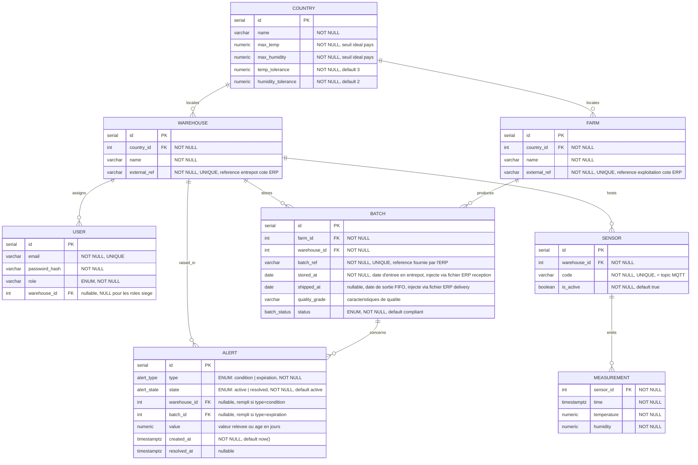

# FutureKawa — Schéma simplifié (strictement conforme au cahier des charges)

Ce schéma retire tout ce qui n'est pas explicitement demandé en section III (Besoins
exprimés) et IV (Livrables) du sujet :

- **Supprimé** : `ORDERS`, `BATCH_DELIVERY`, `DELIVERY`, `CLIENT` — gestion de commandes non
  demandée (mentionnée une seule fois, en section I, comme description du business
  model de l'entreprise, pas comme exigence fonctionnelle du projet).
- **Supprimé** : `is_compliant` (flag d'audit), `SENSOR_ASSIGNMENT` (capteur par lot,
  déjà identifié comme dérive), `NOTIFICATION` (l'`ALERT` porte déjà l'info affichable
  en app ; l'email est un effet de bord de sa création, pas une entité séparée).
- **Simplifié** : `batch_status` passe de 8 valeurs à 3, calquées mot pour mot sur
  l'exemple du sujet (`compliant` / `alert` / `expired` — conforme / en alerte /
  périmé). Le mécanisme de péremption dédié (job, fonction partagée avec le consumer
  IoT) disparaît : c'est la même logique d'alerte qui pose le statut, que la cause soit
  une dérive de conditions ou un lot trop ancien.

Cible : **PostgreSQL 16** (+ TimescaleDB pour `MEASUREMENT`, en hypertable).

---

---

## Notes de lecture

- **`batch_status`** : ENUM `compliant` / `alert` / `expired`. Champ purement
  déclaratif, lié à la présence en stock — aucune contrainte structurelle ne
  retire un lot du FIFO sur la base du statut qualité ; c'est `shipped_at` qui gère la
  sortie du FIFO (cf. ci-dessous), indépendamment du fait que le lot ait été `alert` ou
  `expired` à un moment de son historique.
- **`batch_ref` — clé de rapprochement avec l'ERP** : l'application ne renvoyant aucune
  donnée à l'ERP (pas de callback, pas d'API exposée côté ERP), l'`id` interne
  (`serial`) ne lui est jamais communiqué. `batch_ref` est la référence externe fournie
  par l'ERP dans le fichier de réception, stockée telle quelle, et réutilisée telle
  quelle dans le fichier de delivery pour désigner le lot à faire sortir. `UNIQUE` au
  sein de la base pays (chaque pays a sa propre base, pas de risque de collision
  inter-pays). L'`id` interne reste la PK et la clé utilisée par le frontend siège ;
  `batch_ref` ne sert qu'à l'ingestion fichier.
- **`FARM.external_ref` / `WAREHOUSE.external_ref` — même logique de rapprochement** :
  un pays a plusieurs exploitations et plusieurs entrepôts ; l'ERP ne connaît ni l'un ni
  l'autre par leur `id` interne. Le fichier de réception doit donc fournir `farm_ref` et
  `warehouse_ref`, résolus par simple `WHERE external_ref = ...`. Pas besoin d'un
  équivalent sur `COUNTRY` : chaque backend pays est une base séparée, le pays est déjà
  déterminé par le fait que le fichier atterrit sur ce backend-là.
- **`stored_at` / `shipped_at`, symétrie d'intégration ERP** : les deux champs sont
  renseignés par le même mécanisme d'ingestion fichier, dans deux dossiers distincts
  surveillés par le backend pays — `incoming/reception/` (crée un `BATCH`, résout
  `farm_ref`/`warehouse_ref`, renseigne `batch_ref` et `stored_at`) et
  `incoming/delivery/` (résout le `BATCH` existant via `batch_ref`, renseigne
  `shipped_at`). Aucune entité "commande" n'est créée : le fichier delivery ne porte que
  `batch_ref` et la date de sortie. La requête FIFO devient
  `WHERE shipped_at IS NULL ORDER BY stored_at ASC`.
- **`ALERT.warehouse_id` vs `ALERT.batch_id`** : une alerte `condition` est déclenchée
  par l'entrepôt (capteur ambiant, cf. état des lieux précédent), une alerte
  `expiration` est propre à un lot. Un seul des deux FK est rempli selon `type`.
- **Sortie FIFO : aucun contrôle applicatif précisé dans le sujet** : le fichier `delivery`
  peut désigner n'importe quel lot non expédié de l'entrepôt, l'application ne vérifie
  pas qu'il s'agit bien du plus ancien. Le choix du lot relève de l'ERP, pas de la
  solution ; le sujet ne demande qu'une consultation triée par date, pas une contrainte
  bloquante à l'écriture. On pourra ajouter une alerte si on a le temps.
- **Passage `alert` → `compliant`** :  ça reste un statut informatif que quelqu'un remet à jour manuellement. Le sujet ne
  tranche pas, donc c'est à nous de fixer la règle.
- **`quality_grade`** : couvre "des caractéristiques de qualité" mentionné dans le
  sujet sans préciser le format — laissé en `varchar` faute de plus de détail dans le
  cahier des charges ; à typer plus finement si vous avez une nomenclature (calibre,
  grade SCA, etc.).
- **`recorded_by` retiré** : il référençait un `USER` humain qui enregistrait le lot
  depuis un formulaire. Puisqu'il n'y a plus de saisie humaine (l'enregistrement vient du
  fichier ERP), ce champ n'a plus de porteur légitime. `USER` reste utile pour
  l'authentification sur le frontend siège (lecture seule), mais n'est plus lié à
  `BATCH`.

## Nouvelles US à écrire

- **"Ingestion fichier — réception d'un lot"** : watcher sur `incoming/reception/`,
  parse JSON (`batch_ref`, exploitation, qualité, `stored_at`), résolution `farm_id`,
  appel interne à `POST /api/batches` (persiste `batch_ref` tel quel), déplacement du
  fichier vers `processed/`/`error/`. Si `batch_ref` existe déjà en base, le fichier part
  en erreur plutôt que de créer un doublon.
- **"Ingestion fichier — delivery / sortie FIFO"** : watcher sur `incoming/delivery/`,
  parse JSON (`batch_ref`, date de sortie), résolution du `BATCH` via `batch_ref`
  (lookup interne au watcher, pas un endpoint public), puis appel interne à
  `PATCH /api/batches/{id}/ship`. Si `batch_ref` est introuvable ou déjà `shipped_at`
  non nul, le fichier part en erreur. Aucune vérification que le lot désigné est le plus
  ancien du stock : l'ERP est responsable de ce choix, l'API se contente d'enregistrer
  la sortie.
