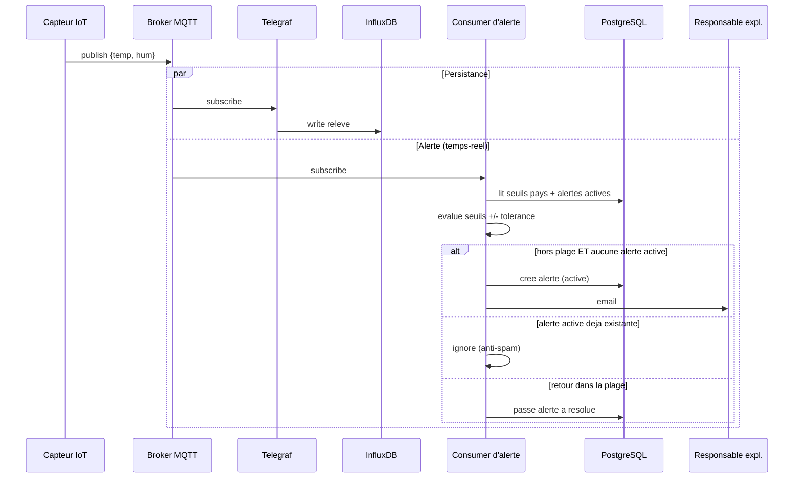

```mermaid
sequenceDiagram
    participant C as Capteur IoT
    participant M as Broker MQTT
    participant T as Telegraf
    participant I as InfluxDB
    participant A as Consumer d'alerte
    participant P as PostgreSQL
    participant R as Responsable expl.

    C->>M: publish {temp, hum}
    par Persistance
        M->>T: subscribe
        T->>I: write releve
    and Alerte (temps-reel)
        M->>A: subscribe
        A->>P: lit seuils pays + alertes actives
        A->>A: evalue seuils +/- tolerance
        alt hors plage ET aucune alerte active
            A->>P: cree alerte (active)
            A->>R: email
        else alerte active deja existante
            A->>A: ignore (anti-spam)
        else retour dans la plage
            A->>P: passe alerte a resolue
        end
    end
```