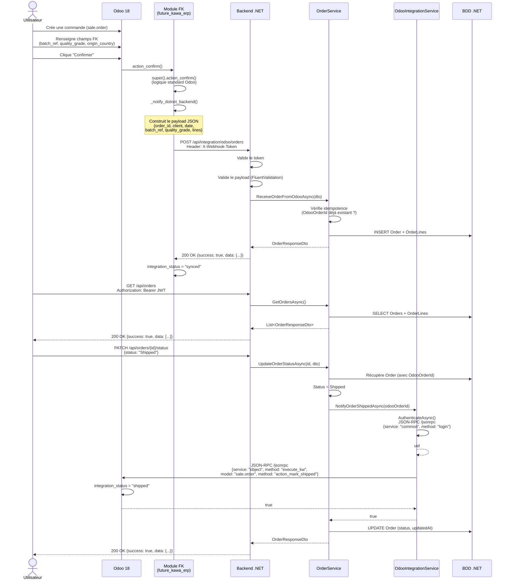

# Diagramme de séquence — Flux commande (Odoo ↔ .NET)

## Scénario complet : de la création à l'expédition

## Points clés pour la démonstration

1. **Webhook (Odoo → .NET)** : Le module Python surcharge `action_confirm()` et envoie un POST HTTP. Interpréter les lignes de `_notify_dotnet_backend()` dans `sale_order.py`.

2. **Validation** : Le backend .NET valide le token partagé puis le payload avec FluentValidation. Interpréter `OdooOrderWebhookValidator.cs`.

3. **Idempotence** : Le `OrderService` vérifie si la commande existe déjà avant de l'insérer. Interpréter `ReceiveOrderFromOdooAsync()` dans `OrderService.cs`.

4. **JSON-RPC (.NET → Odoo)** : Le `OdooIntegrationService` authentifie puis appelle `execute_kw` pour déclencher `action_mark_shipped`. Interpréter `NotifyOrderShippedAsync()` dans `OdooIntegrationService.cs`.

5. **Pattern d'extension Odoo** : Le module surcharge `action_confirm()` en appelant `super()` puis ajoute un comportement. C'est le pattern standard d'extension d'un progiciel intégré.
