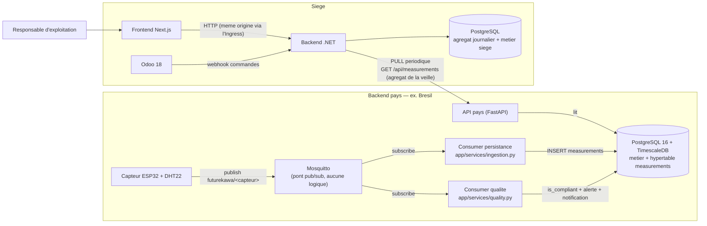
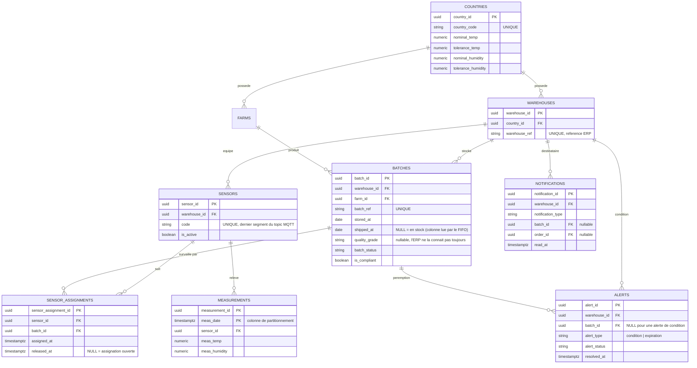
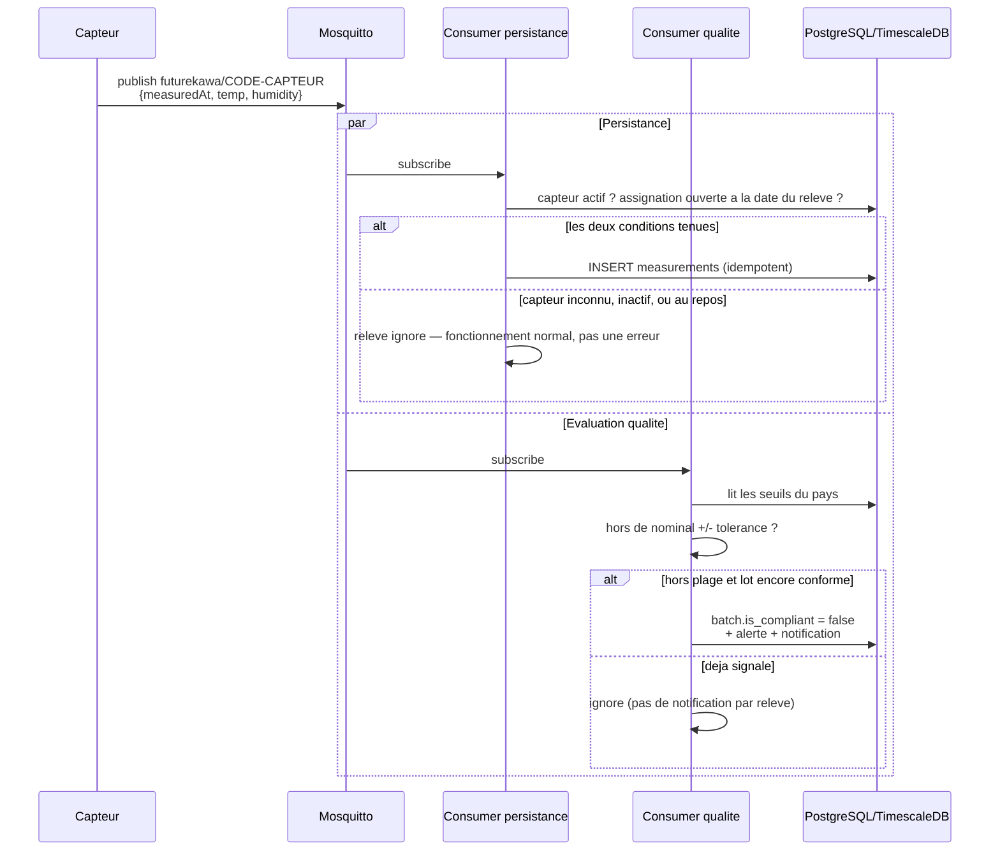
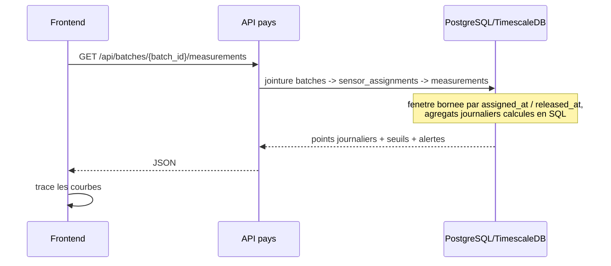
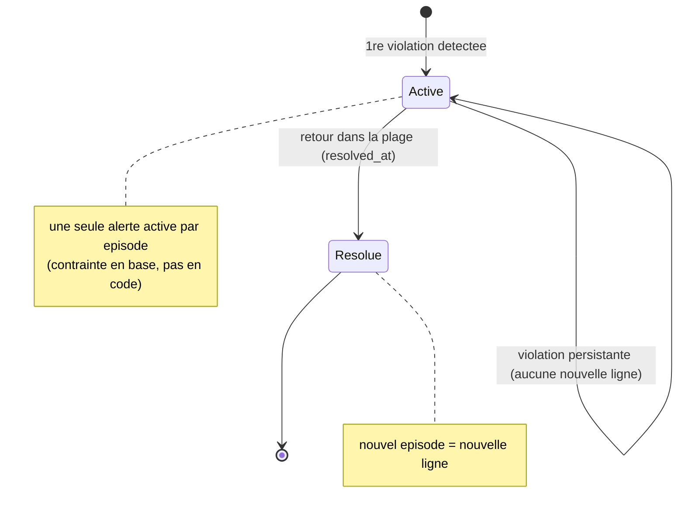
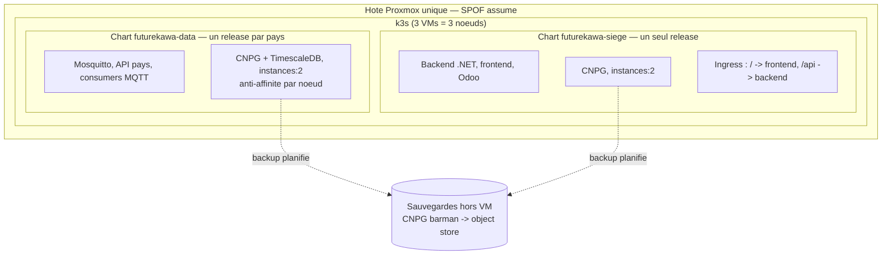
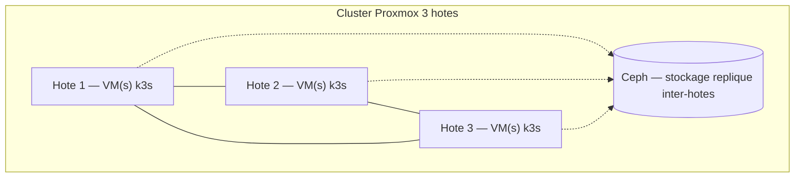

# FutureKawa — Diagrammes d'architecture

Diagrammes Mermaid documentant les choix de conception de la solution de suivi des
stocks et des conditions de stockage (MSPR Bloc 4).

> **Moteur de données unique : PostgreSQL 16 + TimescaleDB** — métier relationnel et
> relevés IoT dans la même base, `measurements` en hypertable. Le projet répond donc à
> l'exigence SQL du cahier sans déviation : la corrélation lot↔mesures est une jointure
> native, pas une orchestration entre deux moteurs.
>
> Source de vérité du schéma : `Api/app/models.py` + `Api/alembic/`
> ([ADR-001](../../Documentation/adr/001-gouvernance-schema-donnees.md)). Ces diagrammes
> sont des **vues dérivées** : en cas de divergence, le code fait foi.

---

## 1. Architecture distribuée (pays ↔ siège)

Un backend autonome par pays — base, broker MQTT, API REST — et un siège agrégateur.
Le siège **tire** les données par HTTP ; il n'ouvre jamais de connexion à la base d'un
pays. La démo tourne avec un seul pays, mais rien dans la topologie n'en suppose un seul.

**Décisions illustrées :** fan-out MQTT — les deux consumers sont **indépendants**, un
échec de l'évaluation qualité n'empêche pas la persistance et réciproquement · le broker
reste un pont sans logique · un seul moteur de données par pays · communication
pays↔siège uniquement par HTTP.

> **Limite connue.** Le seul flux effectivement branché entre pays et siège est
> l'agrégat journalier des mesures. Les lots et les alertes ne traversent pas encore :
> voir §5.

---

## 2. Modèle de données

Identité hybride : UUID technique (anti-collision en contexte réparti) doublé d'une
référence lisible (`batch_ref`, `warehouse_ref`, `sensor.code`) que l'ERP et le firmware
manipulent.

**Décisions illustrées :**

- **Seuils portés par le pays**, sous forme de bande `nominal ± tolerance` : un relevé
  sort de la plage aussi bien par le bas que par le haut.
- **`SENSOR_ASSIGNMENTS` est la pièce qui rend le reste possible.** Un capteur appartient
  à une salle, pas à un lot, et publie en continu — y compris quand la salle est vide.
  Sans cette table, « les relevés de ce lot » ne s'exprime pas : on servirait tout
  l'historique de la salle pour chaque lot qu'elle a hébergé.
- **Clé primaire composite sur `MEASUREMENTS`.** TimescaleDB exige la colonne de
  partitionnement dans toute contrainte d'unicité, clé primaire comprise. Le couple
  `(sensor_id, meas_date)` porte en plus l'idempotence : un broker en QoS 1 redélivre, et
  rejouer un message ne doit pas dupliquer une ligne.
- **`ALERTS` et `NOTIFICATIONS` sont distinctes.** Une alerte est le constat technique
  d'un franchissement de seuil ; une notification dit que quelqu'un doit regarder quelque
  chose. La notification porte une clé étrangère et non une phrase rendue : le libellé
  appartient à l'API, et un message stocké vieillirait mal.

> **Point ouvert signalé par l'ADR-001** : `batch_status` est une colonne stockée, et
> trois vocabulaires coexistent encore (documentation, tuples Python, enum C# du siège).
> À unifier avant de s'appuyer dessus pour de l'affichage.

---

## 3. Flux IoT et détection de non-conformité

Le même message est consommé par **deux abonnés indépendants**, chacun avec sa connexion
MQTT et sa session de base. Le broker délivre aux deux ; aucun ne dépend du travail de
l'autre.

**Décisions illustrées :** l'écriture est **filtrée par l'assignation** — écrire tout ce
qui arrive remplirait `measurements` de bruit qu'aucune requête ne saurait rattacher à un
lot · toute exception sur un message est journalisée puis avalée : un relevé malformé est
l'incident d'un message, pas du consumer, et le laisser remonter arrêterait la
surveillance de toute la salle pour une ligne fautive · déduplication vérifiée : 24
relevés hors seuil consécutifs produisent **une** notification.

---

## 4. Consultation des courbes d'un lot

La corrélation lot↔mesures est une jointure SQL native, dans le même moteur : un seul
endpoint, une seule requête.

**Décisions illustrées :** la fenêtre temporelle vient de l'assignation, pas de la date de
stockage du lot · les agrégats sont calculés en base et non côté API · les seuils du pays
sont renvoyés avec la série, pour que le client trace les bandes sans second appel.

---

## 5. Ce qui traverse — et ce qui ne traverse pas encore

```mermaid
flowchart LR
    subgraph P["Pays"]
        PM[("measurements")]
        PB[("batches")]
        PN[("alerts / notifications")]
    end
    subgraph S["Siege"]
        SM[("Measurements")]
        SB[("Batches — vide")]
        SA["GET /api/alerts — absent"]
    end
    FRONT["Frontend"]

    PM -->|"MeasurementSync : agregat de la veille — OK"| SM
    PB -.->|"aucun flux"| SB
    PN -.->|"aucun emetteur cote pays"| SA
    FRONT -->|"appelle GET /api/alerts"| SA
```

**État vérifié sur la stack complète :**

| Flux | État |
|---|---|
| Agrégat journalier des mesures, pays → siège | **fonctionne** (3 entrepôts, 3 persistés, 0 erreur) |
| Lots, pays → siège | **aucun flux** — la table du siège reste vide |
| Alertes, pays → siège | **aucun émetteur** : `quality.py` n'émet aucun appel HTTP |
| `GET /api/alerts` côté siège | **n'existe pas** (405) — seul un `POST` de réception est implémenté |

Le `AlertsController` du siège annonce dans sa documentation qu'il reçoit les alertes de
l'API pays, avec authentification par `X-Api-Key`. Le récepteur existe donc, mais
**personne ne l'appelle**, et **rien ne relit** ce qu'il enregistrerait. La cloche
d'alertes du frontend ne peut par conséquent jamais s'allumer. Voir les issues #33 et #39.

---

## 6. Cycle de vie d'une alerte

Append-only : une ligne par épisode. La résolution pose `resolved_at` sans réécrire
l'historique — c'est la sémantique des systèmes de supervision.

**Décisions illustrées :** l'unicité de l'alerte active est garantie **par la base** et
non par une vérification applicative, qui laisserait passer deux consumers concurrents ·
l'alerte « lot au-delà de 365 jours » n'a pas d'événement MQTT déclencheur : elle relève
d'un balayage périodique, pas de ce flux.

---

## 7. Cible de déploiement — k3s multi-VM sur un hôte Proxmox

Trois VMs d'un même hôte Proxmox forment un cluster k3s multi-nœuds. La haute
disponibilité est atteinte **au niveau nœud/VM** : crash de VM, panne de nœud, upgrade
roulant, failover CloudNativePG. Le **serveur physique reste un SPOF assumé** ; la perte
de données est couverte par des sauvegardes hors VM.

**Décisions illustrées :**

- **Deux charts et non un seul** : la stack pays se déploie une fois par pays, le siège
  est unique. Les fondre obligerait à redéployer le siège à chaque pays ajouté.
- **Postgres = cluster CNPG `instances:2`** : le failover est piloté par l'opérateur et
  non par un quorum entre instances, deux suffisent donc. Réplication par streaming :
  aucun stockage répliqué n'est requis pour la base.
- **Frontend et API sur la même origine** derrière l'Ingress. Ce n'est pas cosmétique :
  le cookie de refresh est `SameSite=Strict`, et deux origines distinctes l'empêcheraient
  d'être transmis — la reconnexion silencieuse au chargement échouerait.
- **Mosquitto sur un StorageClass réattachable** (Longhorn) en multi-nœuds : `local-path`
  épinglerait le pod à son nœud et l'ingestion ne survivrait pas à la perte de la VM.
- **Durabilité = sauvegardes CNPG hors VM.** La réplication protège de la panne d'un
  nœud, pas d'une suppression accidentelle.

---

## 8. Évolution vers une HA multi-hôte réelle

La HA nœud/VM est atteinte (§7). Pour survivre à la perte de l'hôte physique — le SPOF
assumé — l'évolution est un cluster Proxmox multi-hôtes :

**Chemin d'évolution :** k3s réparti sur trois hôtes (HA manager pour le failover de VM)
et **Ceph** pour des PVC répliqués inter-hôtes. CloudNativePG place alors ses instances
sur des hôtes distincts, ce qui donne une vraie tolérance à la perte d'un hôte. Aucun de
ces éléments n'est exigé par le cahier, qui demande une architecture tolérante aux pannes
et une résilience justifiée — ce que la solution livre déjà au niveau nœud/VM.
