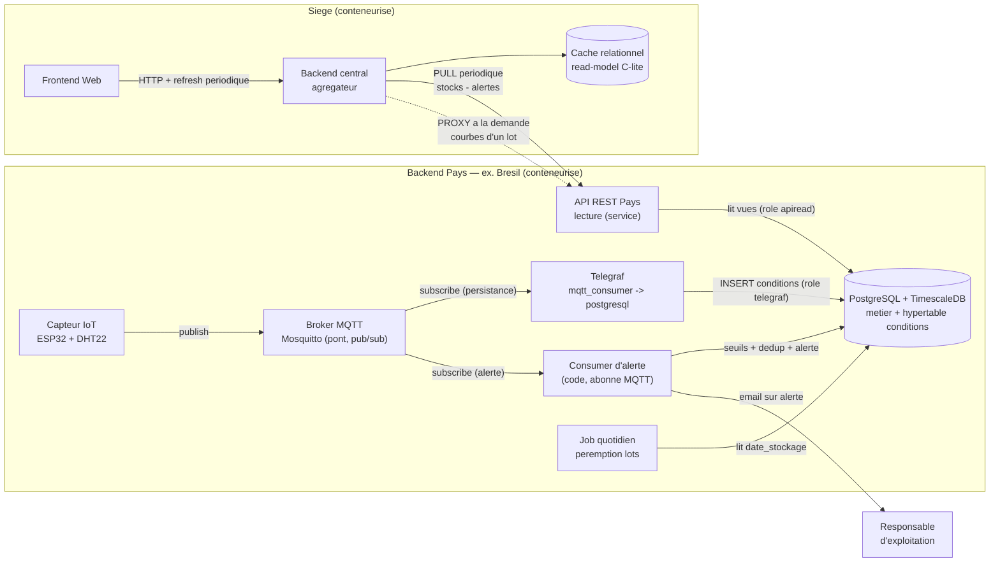
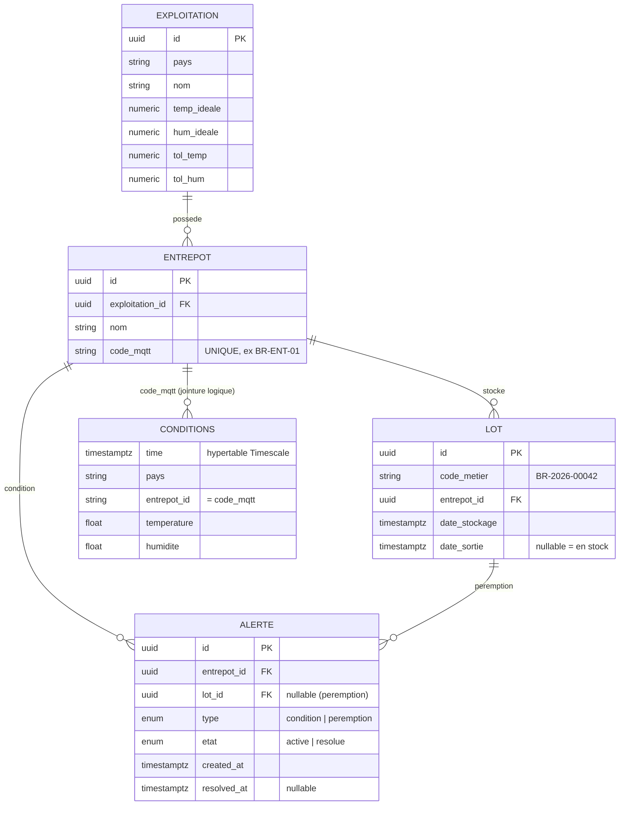
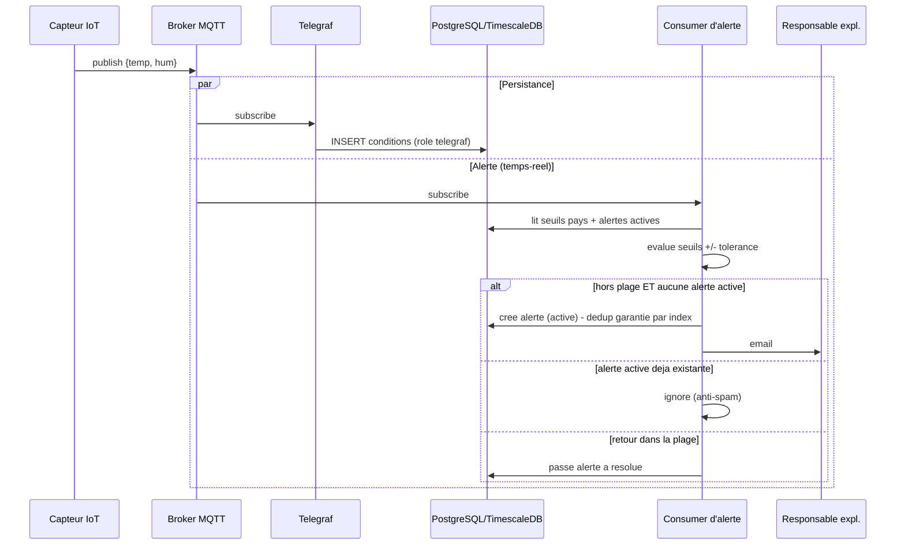
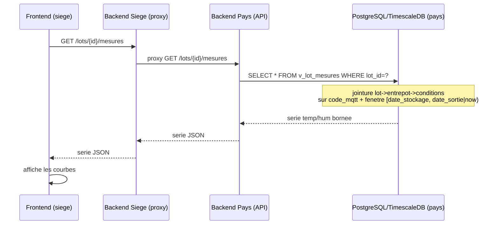
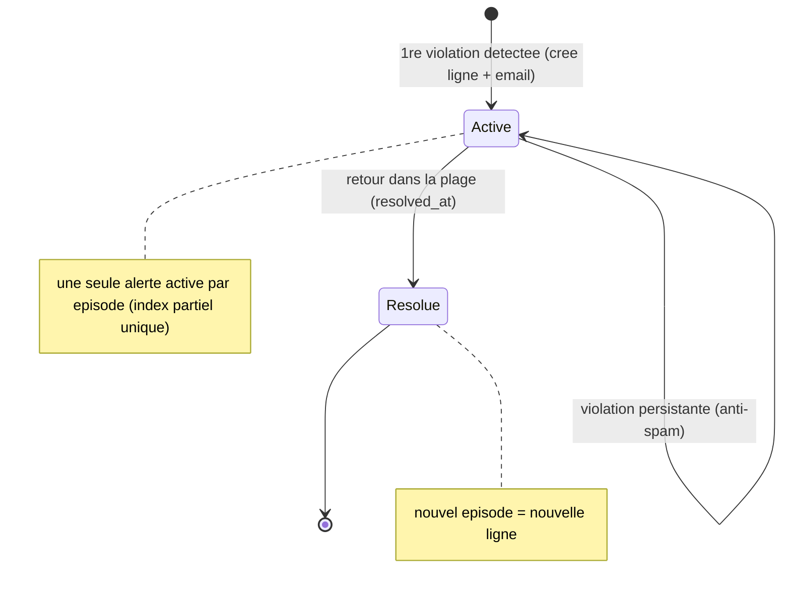
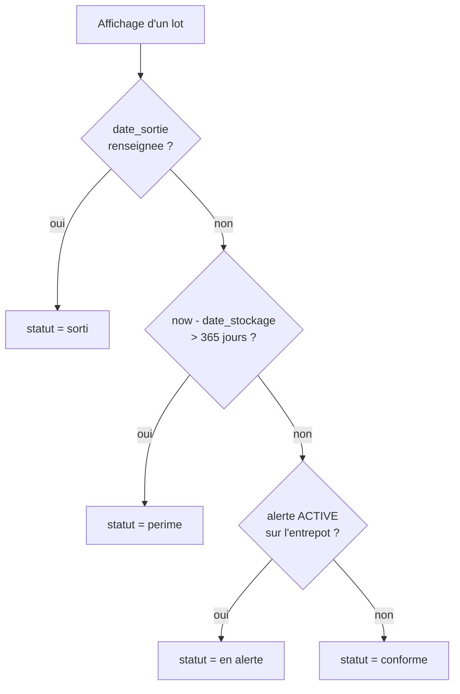
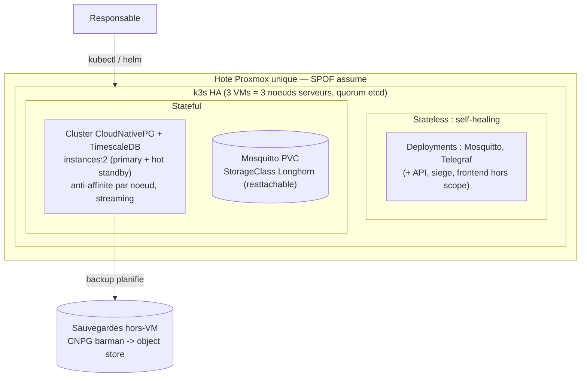
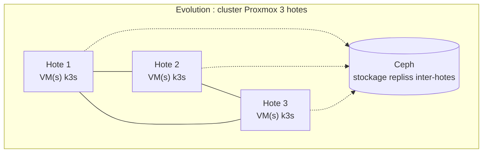

# FutureKawa — Diagrammes d'architecture

> [!IMPORTANT]
> **Document partiellement obsolète.** L'ingestion décrite ici (pont **Telegraf** vers une
> hypertable `conditions`, migrations **Flyway**) a été remplacée par les **consumers Python**
> (`Api/app/consumers/`) écrivant dans `measurements`, et par les migrations **Alembic**.
> Le contrat de topic a changé lui aussi : `futurekawa/<code capteur>` avec les champs
> `temp`/`humidity`, et non `futurekawa/{pays}/{code_mqtt}/conditions` avec
> `temperature`/`humidite`.
>
> Source de vérité du schéma : `Api/app/models.py` + `Api/alembic/` (ADR-001).
> Déploiement à jour : [`database/README.md`](../README.md).
> Réécriture de ce document à planifier.

Diagrammes Mermaid documentant les choix de conception de la solution de suivi
des stocks et conditions de stockage (MSPR Bloc 4).

> **Moteur de données unique : PostgreSQL 16 + TimescaleDB** (métier relationnel +
> relevés IoT en hypertable). Le projet est **conforme à l'exigence SQL** du cahier.
> Rendu : GitHub/GitLab affichent ces blocs nativement, ou https://mermaid.live.

---

## 1. Architecture distribuée (pays ↔ siège)

Topologie répartie : un backend autonome par pays (PostgreSQL/TimescaleDB + broker
MQTT + API REST), un siège agrégateur. Le siège **pull** le relationnel léger et
**proxy** les courbes à la demande — communication **uniquement via l'API**, jamais
en base. Démo mono-backend, mais architecture conçue pour N pays.

**Décisions illustrées :** **fan-out MQTT** — deux abonnés indépendants (Telegraf → DB
pour la persistance, consumer d'alerte → DB + email en temps-réel) · le broker reste
un pont pub/sub · **un seul moteur de données par pays** · API en lecture seule via un
rôle dédié · siège agrégateur cache C-lite · pull relationnel + proxy time-series · API-only.

---

## 2. Modèle de données (PostgreSQL/TimescaleDB)

Identité **hybride** : `id` (UUID technique, anti-collision en contexte réparti) +
code lisible (`code_metier`, `code_mqtt`). Les relevés vivent dans la **hypertable
`conditions`** (même moteur). Le **statut de lot n'est pas une colonne** : dérivé au read (diagramme 6).

**Décisions illustrées :** seuils/tolérances au niveau pays · UUID + code métier ·
`entrepot.code_mqtt` (clé de rattachement des relevés) · `lot.date_sortie` (fenêtre) ·
relevés en hypertable jointe par `code_mqtt` · alertes append-only · pas de colonne `statut`.

---

## 3. Flux IoT et levée d'alerte (fan-out événementiel)

Le même message MQTT est consommé par **deux abonnés indépendants** : Telegraf le
persiste dans la hypertable `conditions` ; un **consumer d'alerte** (en code) évalue les
seuils en temps-réel, gère la déduplication et envoie l'email. Le chemin de persistance
reste intact, l'alerting n'en dépend pas.

**Décisions illustrées :** fan-out pub/sub · alerting en code (testable), indépendant
de la persistance · déduplication par épisode garantie par la base · email local au pays.
(L'alerte « lot > 365 j » n'a pas d'événement MQTT → **job quotidien** lisant PostgreSQL.)

---

## 4. Consultation des courbes d'un lot (smart endpoint 100 % SQL)

La corrélation lot↔mesures est une **jointure SQL native** (même moteur) : un seul
endpoint, une seule requête. Le siège ne fait que **proxy**, le frontend affiche.

**Décisions illustrées :** corrélation = **une requête SQL** (plus d'orchestration
bi-moteur) · jointure sur `code_mqtt` + fenêtre temporelle · le time-series ne transite
jamais en masse vers le siège (proxy à la demande).

---

## 5. Cycle de vie d'une alerte

Append-only : une ligne par occurrence. La résolution pose `resolved_at` sans
réécrire l'historique. C'est la sémantique des systèmes de supervision.

**Décisions illustrées :** alertes append-only · état `active`/`résolue` (CHECK sur
`resolved_at`) · traçabilité par `created_at`/`resolved_at`.

---

## 6. Statut de lot — dérivé au read

Le statut n'est jamais stocké : il se calcule à l'affichage. Zéro incohérence.

**Décisions illustrées :** une seule source de vérité par fait · statut = projection ·
branche `sorti` (via `date_sortie`) · péremption calendaire (café vert, seuil unique 365 j).

---

## 7. Cible de déploiement — k3s multi-VM sur un hôte Proxmox

Déploiement réel sur **3 VMs d'un même hôte Proxmox** → cluster k3s multi-nœuds
(quorum etcd). **HA au niveau nœud/VM** (crash VM, panne de nœud, upgrade roulant,
failover CNPG). Le **serveur physique reste un SPOF assumé** ; la perte de **données**
est couverte par des **sauvegardes hors-VM**. Livrable de démo : `docker compose up`.

**Décisions illustrées :** stateless = `Deployment` (self-healing) · Postgres = **cluster
CNPG `instances:2`** (failover opérateur, pas de quorum Postgres) · réplication par
streaming (pas de stockage répliqué requis pour PG) · Mosquitto/Longhorn réattachable ·
**durabilité = backups CNPG hors-VM** · SPOF hôte assumé (HA multi-hôte → diagramme 8).

---

## 8. Évolution vers une HA multi-hôte réelle

La HA **nœud/VM** est atteinte (diagramme 7). Pour survivre à la **perte de l'hôte
physique** (le SPOF assumé), l'évolution est un **cluster Proxmox multi-hôtes** :

**Chemin d'évolution :** k3s réparti sur **3 hôtes Proxmox** (HA manager pour le
failover de VM) + **Ceph** (PVC répliqués inter-hôtes) → CloudNativePG place alors ses
instances sur des hôtes distincts (vraie tolérance à la perte d'un hôte). Aucun de ces
éléments n'est requis par le cahier (qui demande une architecture *tolérante aux pannes*
et une *résilience justifiée*) — ce que la solution livre déjà au niveau nœud/VM.

---

Le cahier des charges impose une persistance **SQL** : le choix **PostgreSQL + TimescaleDB**
(hypertable pour les relevés IoT) y répond **sans déviation** — un seul moteur, jointures
natives, une seule stratégie de HA (CloudNativePG) et de sauvegarde (barman hors-VM).
